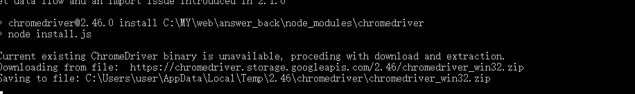

### 全局安装 vue-cli
1.$ cnpm install --global vue-cli 

如果已经安装过了就不用安装了，这里我前面的项目已经安装过了，所以直接从第二步开始
<!-- more -->
### my-project为自定义项目名
2.$ vue init webpack my-project

需要注意的是项目的名称不能大写，不然会报错


### 项目初始化时会询问一些安装项，可以根据自己的需求选择


Project name (my-project) ==>项目名称（我的项目）


Project description (A Vue.js project) ==>项目描述一个Vue.js 项目


 Author 作者（你的名字）


nstall vue-router? (Y/n) ==>是否安装Vue路由，也就是以后是spa（但页面应用需要的模块）yes

Use ESLint to lint your code? (Y/n) ==>使用 ESLint 到你的代码？ （Y [ yes ] / N [ no ]）此处建议选no，如果不是按照ESLint风格，编译时就会报错（就是这里坑了我，找半天没发现逻辑问题）


Pick an ESLint preset (Use arrow keys) ==>选择一个预置ESLint（使用箭头键） 


Setup unit tests with Karma + Mocha? (Y/n) ==>设置单元测Karma + Mocha？ （Y/ N）由于我们现在还没有单元测试，所以这里选择的是”N”


Setup e2e tests with Nightwatch? (Y/n) ==>设置端到端测试，Nightwatch？这里需要选yes，否则会报websocket的错误 （Y/ N）Y

3.最后一步就是安心等待啦


完成后运行npm run Dev项目就运行起来啦


这几个配置选择yes 或者 no 对于我们项目最大的影响就是，如果选择了yes 则生成的项目会自动有相关的配置，有一些loader我们就要配套下载。所以如果我们确定不用的话最好选no，要么下一步要下很多没有用的loader

未进行说明的配置直接回车默认就行，影响不大

**注：**

Vue取消eslint语法限制

在build/webpack.base.conf.js文件中，注释或者删除掉：module->rules中有关eslint的规则


vue-cli脚手架搭建环境时报出chromedriver的错误：


出现原因：未设置科学上网 （翻墙）或者. npm 源未设置为国内镜像源

解决方法：执行以下命令
```
npm install chromedriver --chromedriver_cdnurl=http://cdn.npm.taobao.org/dist/chromedriver
```


### 手机预览
```
<!-- 手机预览vue项目 -->
<!-- 1.找到config文件下的index.js 将dev配置中的host:'localhost'改为host:'0.0.0.0' -->
<!-- 2.重新运行项目npm run dev -->
<!-- 3.在浏览器地址输入：本机ip地址:项目所占端口号 如：http://192.168.1.184:8080/#/-->
```