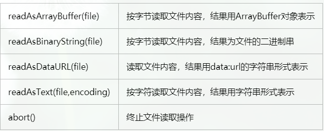
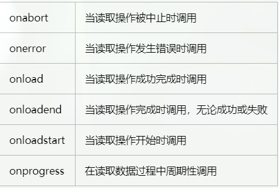

### 将图片上传功能封装为一个组件（<imgupload>组件）
思路：使用input的file类型来上传图片，然后在利用FileReader读取到文件中的数据。

FileReader提供了如下方法：
)
<!--more-->
事件：
)

#### 结构
```
//结构
<template>       
<div class="upload">
    <label for="file"></label>
    <input type="file" @change="getFile" ref="file" id="file">
</div>

</template>
```

#### 图片上传的js
```
//js
import logo from '../assets/images/index_logo.png'
export default {
    data(){
     return{
        src:logo
     }
    },
    methods: {
        //base64转为formdata
        dataURItoBlob(dataURI) {
            var byteString = atob(dataURI.split(',')[1]);
            var mimeString = dataURI.split(',')[0].split(':')[1].split(';')[0];
            var ab = new ArrayBuffer(byteString.length);
            var ia = new Uint8Array(ab);
            for (var i = 0; i < byteString.length; i++) {
                ia[i] = byteString.charCodeAt(i);
            }
            return new Blob([ab], {type: mimeString});
        },
        getFile:function(e){
            let _this = this
            let value_ = e.target
            let files = e.target.files[0]//获取上传的图片

            let size_ = 200;//文件限制的大小，单位为kb
            let fileSize = (files.size / 1024).toFixed(0)//文件大小，单位kb
            let fileType = value_.value.substring(value_.value.lastIndexOf("."))//文件格式

            if (!e || !window.FileReader) { return }//是否支持FileReader
            let reader = new FileReader()//new一个FileReader对象
            reader.readAsDataURL(files) //将文件读取为 DataURL
            //判断文件大小
            if (fileSize > size_) {
                alert('文件过大')
                return false
            }
            
            if (!fileType.match(/.jpg|.jpeg|.gif|.png|.bmp/i)) {
                alert('请上传正确格式的图片')
                return false;
            }


            reader.onload = function(){//文件读取成功result 属性返回读取的结果
                _this.src = this.result//展示图片
                //将base64转为formdata
                var blob = _this.dataURItoBlob(this.result);
                let format = new FormData()
                format.append('src',blob)
                _this.$emit('getImage',format)//将路径传出去
            }
        }
    }
}

```

#### 组件的样式
```
//样式
 @r:2px;
   .upload img{
        display: block;
        width: 108/@r;
        height: 108/@r;
        margin-bottom: 34/@r;
    }
   .upload input {
        display: none;
    }
```


### 调用

上面将上传功能封装为imgupload组件，下面开始在其他需要的组件内调用

1、引入组件
`import imgupload from '../common/imgupload'`
2、命名组件
```
 export default {
    components:{imgupload},//组件名称
    created(){

    },
    data(){
        return {
            addMask:true,
            src:logo
        }
    },
```

3、调用组件
组件间的关系是使用时产生的，在这里使用imgupload组件，所以imgupload组件是子组件
```
<imgupload @getImage='getImage'></imgupload>
```
上传的图片需要传给后台，所以imgupload组件需要将图片传出来，这里imgupload组件是子组件，子传父使用事件传值（上面代码中的_this.$emit('getImage',format)将图片传出来）
```
methods:{
            
    getImage(imgsrc){
        //imgsrc是imgupload组件传出来的图片数据
        this.src=imgsrc
        // console.log(src)
        
        console.log(imgsrc.get('src'),'666')
        //ajax
    },
}
```