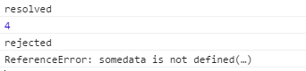

参考自阮老师的ES6入门教程
[传送门](http://es6.ruanyifeng.com/#README)
### Promise用法
Promise是一个构造函数，自己身上有all、reject、resolve这几个方法，原型上有then、catch等方法。

```
var p = new Promise(function(resolve, reject){
    //做一些异步操作
    setTimeout(function(){
        console.log('执行完成');
        resolve('返回的数据');
    }, 2000);
});
```
<!--more-->
Promise构造函数接受一个函数作为参数，该函数的两个参数分别是resolve和reject。它们是两个函数，由 JavaScript 引擎提供，不用自己部署。

resolve函数的作用是，将Promise对象的状态从“未完成”变为“成功”（即从 pending 变为 resolved），在异步操作成功时调用，并将异步操作的结果，作为参数传递出去；reject函数的作用是，将Promise对象的状态从“未完成”变为“失败”（即从 pending 变为 rejected），在异步操作失败时调用，并将异步操作报出的错误，作为参数传递出去


在上面的代码中，我们执行了一个异步操作，也就是setTimeout，2秒后，输出“执行完成”，并且调用resolve方法。
 
运行代码，会在2秒后输出“执行完成”。注意！我只是new了一个对象，并没有调用它，我们传进去的函数就已经执行了，这是需要注意的一个细节。所以我们用Promise的时候一般是包在一个函数中，在需要的时候去运行这个函数，如：

```
function runAsync(){
    var p = new Promise(function(resolve, reject){
        //做一些异步操作
        setTimeout(function(){
            console.log('执行完成');
            resolve('返回的数据');
        }, 2000);
    });
    return p;            
}
runAsync()
```
Promise实例生成以后，可以用then方法分别指定resolved状态和rejected状态的回调函数。
```
runAsync().then(function(data){
    console.log(data);//返回的数据
    //后面可以用传过来的数据做些其他操作
    //......
});
```
在runAsync()的返回上直接调用then方法，then接收一个参数，是函数，并且会拿到我们在runAsync中调用resolve时传的的参数。运行这段代码，会在2秒后输出“执行完成”，紧接着输出“返回的数据”
也就是说then里面的函数就跟我们平时的回调函数一个意思（then(function(data)里面的data就是runAsync()成功后返回的数据）


### 链式调用
实质上，Promise的精髓是“状态”，用维护状态、传递状态的方式来使得回调函数能够及时调用，它比传递callback函数要简单、灵活的多。
常用于封装请求函数等场景：
```
// 导出一个fetch函数，用来发送请求获取数据 
module.exports = function (url, data) {
  return new Promise((resolve, reject) => {
    wx.request({
      url: `https://locally.xiao.com/${url}`,
      // 模板字符串（template string）是增强版的字符串，用反引号（`）标识。它可以当作普通字符串使用，也可以用来定义多行字符串，或者在字符串中嵌入变量。
      // 模板字符串中嵌入变量，需要将变量名写在${}之中。
      data,
      success: resolve,
      // success: function (res) {
      //   resolve(res)
      // },
      fail: reject
    })
  })
}
```

调用导出的函数：
```
fetch('slides')
      .then(res => {
        this.setData({
          list: res.data
        })
      })
```


### reject的用法
上面用了resolve，接下来开始reject，事实上，我们前面的例子都是只有“执行成功”的回调，还没有“失败”的情况，reject的作用就是把Promise的状态置为rejected，这样我们在then中就能捕捉到，然后执行“失败”情况的回调。
```
function getNumber(num){
    var p = new Promise(function(resolve, reject){
        //做一些异步操作
        setTimeout(function(){
            var num = Math.ceil(Math.random()*9); //生成1-9的随机数
            if(num<=5){
                resolve(num);
            }
            else{
                reject('数字太大了');
            }
        }, 2000);
    });
    return p;            
}

getNumber()
.then(
    function(data){
        console.log('resolved');
        console.log(data);
    }, 
    function(reason, data){
        console.log('rejected');
        console.log(reason);
    }
);
```

getNumber函数用来异步获取一个数字，2秒后执行完成，如果数字小于等于5，我们认为是“成功”了，调用resolve修改Promise的状态。否则我们认为是“失败”了，调用reject并传递一个参数，作为失败的原因。
运行getNumber并且在then中传了两个参数，then方法可以接受两个参数，第一个对应resolve的回调，第二个对应reject的回调。所以我们能够分别拿到他们传过来的数据。多次运行这段代码，你会随机得到下面两种结果：

resolved 2 或 rejected 数字太大了


### Promise.prototype.catch()

Promise.prototype.catch方法是.then(null, rejection)或.then(undefined, rejection)的别名，用于指定发生错误时的回调函数。
```
getNumber()
.then(function(data){
    console.log('resolved');
    console.log(data);
})
.catch(function(reason){
    console.log('rejected');
    console.log(reason);
});
```

上面代码中，fetch方法返回一个 Promise 对象，如果该对象状态变为resolved，则会调用then方法指定的回调函数；如果异步操作抛出错误，状态就会变为rejected，就会调用catch方法指定的回调函数，处理这个错误。另外，then方法指定的回调函数，如果运行中抛出错误，也会被catch方法捕获

在执行resolve的回调（也就是上面then中的第一个参数）时，如果抛出异常了（代码出错了），那么并不会报错卡死js，而是会进到这个catch方法中。

```
getNumber()
.then(function(data){
    console.log('resolved');
    console.log(data);
    console.log(numData); //此处的numData未定义
})
.catch(function(reason){
    console.log('rejected');
    console.log(reason);
});
```

在resolve的回调中，我们console.log(somedata);而somedata这个变量是没有被定义的。如果我们不用Promise，代码运行到这里就直接在控制台报错了，不往下运行了。但是在这里，会得到下面的结果：


也就是说进到catch方法里面去了，而且把错误原因传到了reason参数中。即便是有错误的代码也不会报错了，这与我们的try/catch语句有相同的功能。


### all的用法
Promise.all方法用于将多个 Promise 实例，包装成一个新的 Promise 实例。
```
let p1 = new Promise(function(resolve, reject){
    console.log('p1');
    resolve('p1数据');
}
let p2 = new Promise(function(resolve, reject){
    console.log('p2');
    resolve('p2数据')
}
let p3 = new Promise(function(resolve, reject){
    console.log('p3');
    resolve('p3数据')
}
const p = Promise.all([p1, p2, p3]);
```
上面代码中，Promise.all方法接受一个数组作为参数，p1、p2、p3都是 Promise 实例
（Promise.all方法的参数可以不是数组，但必须具有 Iterator 接口，且返回的每个成员都是 Promise 实例。)

```
Promise
.all([p1, p2, p3])
.then(function(results){
    console.log(results);
});
```

all会把所有异步操作的结果放进一个数组中传给then，就是上面的results。所以上面代码的输出结果就是：
```
//p1
//p2
//p3
//["p1数据"，"p2数据"，"p3数据"]
