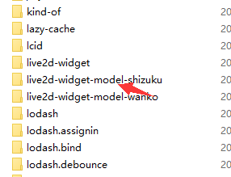

### hexo的next主题添加看板动画

1. git定位到根目录文件，并输入以下命令
```
npm install --save hexo-helper-live2d
```
<!--more-->
2. 下载各种模型：npm install + 模型名 (npm install live2d-widget-model-shizuku)
```
live2d-widget-model-chitose
live2d-widget-model-epsilon2_1
live2d-widget-model-gf

live2d-widget-model-haru/01 (use npm install --save live2d-widget-model-haru)

live2d-widget-model-haru/02 (use npm install --save live2d-widget-model-haru)
live2d-widget-model-haruto
live2d-widget-model-hibiki
live2d-widget-model-hijiki
live2d-widget-model-izumi
live2d-widget-model-koharu
live2d-widget-model-miku
live2d-widget-model-ni-j
live2d-widget-model-nico
live2d-widget-model-niet

```
3. 此时再去 node_moduels目录下，可以看到有如下文件夹，这些都是动画主配置

4. 在Hexo根目录中新建文件夹live2d_models，然后在node_modules文件夹中找到刚刚下载的live2d模型，将其复制到live2d_models中
5. hexo的配置文件_config.yml中添加如下配置
```
#2d
live2d:
  enable: true
  scriptFrom: local
  pluginRootPath: live2dw/
  pluginJsPath: lib/
  pluginModelPath: assets/
  tagMode: false
  debug: false
  model:
    use: live2d-widget-model-shizuku
  display:
    position: left
    width: 120
    height: 240
  mobile:
    show: false
```
6. 配置博客站点配置文件，_config.yml将里面的use:换成下载的模型名称
7. hexo d上传后就会在右下角出现live2d动画了

8. 取消看板动画
直接运行npm uninstall hexo-helper-live2d
去掉站点_config.yml下的配置信息即可

### 添加live2d直接引入版（这个是github上人家的api，也许会在哪天失效）
不想配置的话，直接在next/layout/_layout.swig(生成主页面的文件)中引入下面文件
```
//将代码加入<head>或<body>，就可以看到效果了
<script src="https://cdn.jsdelivr.net/npm/jquery/dist/jquery.min.js"></script>
<link rel="stylesheet" href="https://cdn.jsdelivr.net/npm/font-awesome/css/font-awesome.min.css"/>
<script src="https://cdn.jsdelivr.net/gh/stevenjoezhang/live2d-widget/autoload.js"></script>
```
此配置来自github上大佬的资源，[附上大佬的github地址](https://github.com/stevenjoezhang/live2d-widget)
这是人家的一个api，也许哪天挂了呢？如果想一直使用要拷贝到自己的服务器中，并搭建php环境，[api的github地址](https://github.com/fghrsh/live2d_api)
